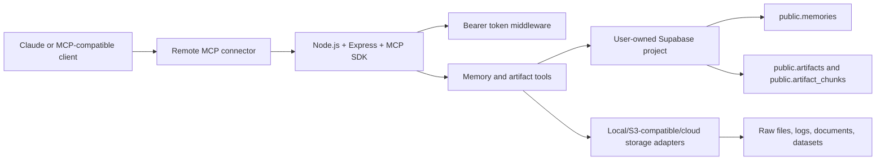

# Architecture

Shared AI Memory MCP is a self-hosted Remote MCP server.

## Runtime Layers

- `src/server.ts`: Express server and Streamable HTTP MCP transport.
- `src/auth.ts`: bearer token protection.
- `src/config.ts`: environment parsing and validation.
- `src/logger.ts`: structured logging that avoids memory content.
- `src/db.ts`: Supabase persistence adapter.
- `src/storage/*`: artifact storage adapters.
- `src/tools/*`: MCP tool registrations.
- `src/types/index.ts`: shared memory types.

## Portability

The app listens on `process.env.PORT` with a local fallback of `3000`. It does not assume localhost and can run behind common cloud proxies or reverse proxies.

## Search

v1 uses PostgreSQL text matching through Supabase filters. The migration adds `pg_trgm` and a trigram index on `content` so the database is ready for better text search. Vector search can be added later behind the DB/search layer without changing tool names.
